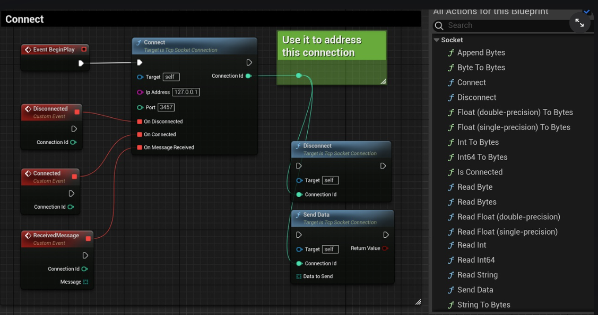
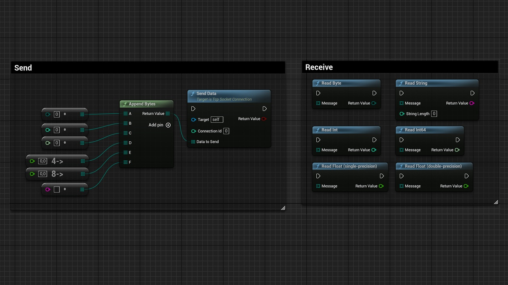

# L_UnrealExample

ue 学习过程中实现的各种小玩意...

## 四叉树聚类
- Reference
  - [UE4 C++ 四叉树实现及可视化](https://www.cnblogs.com/shiroe/p/15526194.html)
  - [UE 四叉树聚类参考](https://www.bilibili.com/opus/931946614102163474?jump_opus=1)
  - [UE5使用聚类算法实现cesium点聚合功能](https://zhuanlan.zhihu.com/p/632613588)
  - 最终实现效果：[UE 四叉树聚类效果](https://www.bilibili.com/video/BV1Sx4y1i7nv/)

## TCPSocket 进程检测脚本
- 需求
  - UE 总是崩溃：通过外部脚本，检测进程。如果崩溃，自动重启项目。
  - 但如果仅检测 UE 进程，有可能 UE 崩溃了，但是停留在Crush界面（进程仍在运行）。
  - 因此采用：定时向 UE 项目发送消息。如果UE接收到消息，向服务端返回信息。服务端即可确认项目运行状态。
    - 甚至 UE 可以不发，服务端只检测是否收到消息。
- 使用方法
  - 安装 [TCP Socket Plugin](https://www.fab.com/listings/48db4522-8a05-4b91-bcf8-4217a698339b) 到引擎，插件管理页面勾选启用。
  - 新建蓝图，继承TcpSocketConnection。开始连节点。
  - 启动服务端脚本，运行游戏。
  - Connect
    - 
  - Send_Receive
    - 
- Reference
  - [UE4 TCP通信 （UE客户端与网络调试助手服务端、python服务端通信）](https://blog.csdn.net/ChaoChao66666/article/details/127948807)
  - [UE4 + Python TCP插件](https://zhuanlan.zhihu.com/p/139578002)
  > 链接中项目初始版本为4.27，我采用的是5.4，没运行起来。所以改了第二个链接的[脚本](https://github.com/forMyReason/L_UnrealPython/blob/main/Socket/python_tcp.py)，结合第一个链接的[插件](https://www.fab.com/listings/48db4522-8a05-4b91-bcf8-4217a698339b)。
